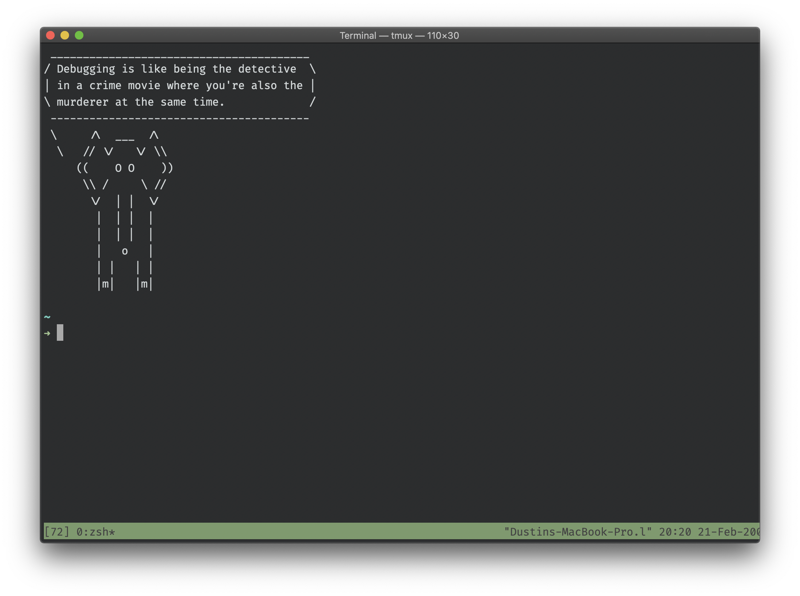

# dotfiles
> Running Terminal.app (zsh shell) with **[Spaceship theme]**(https://github.com/denysdovhan/spaceship-prompt) and **[tmux]**(https://github.com/tmux/tmux).

## About

I created this for symlinking my config files across different devices.

## Files

* `.zshrc` - My configurations for `zsh`.
* `.vimrc` - My configurations for `vim` (v8).
* `.tmux.conf` - My configurations for [`tmux`](https://github.com/tmux/tmux/wiki)

## zsh Configs

* Autoloading tmux.
* Spaceship theme.
* Tab menu for search.
* cowsay with [`Joke API`](https://sv443.net/jokeapi/v2) whenever zsh starts.

## vim Configs

* [`NERDTree`](https://github.com/preservim/nerdtree) with minimal UI autoload.
* Set command-line options.
* Auto indentation by file type.
* Set line numbers.
* [`Coc.vim`](https://github.com/neoclide/coc.nvim) configurations.
* Autoclose for brackes, quotes, blocks, etc.

## tmux Configs

* Mouse mode on.
* Set prefix/command prompt to be Ctrl + Space instead of the default Ctrl + B.
